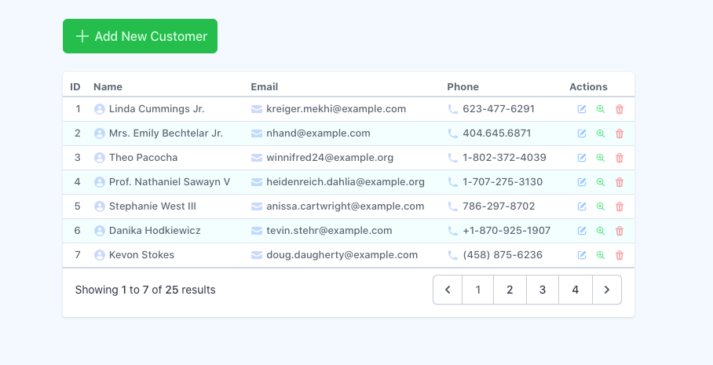

# Laravel10-CRUD-Starter
 Simple Demo Project using Laravel Framework with CRUD operation



## Installation

```bash
composer create-project laravel/laravel:^10.0 Laravel10-CRUD-Starter
```

Install NPM packages:

```bash
cd Laravel10-CRUD-Starter
npm install
```

Edit database configuration in `.env` file:

```bash
DB_DATABASE=lf10_crud_starter
DB_USERNAME=root
DB_PASSWORD=
```

Run the migration

```bash
php artisan migrate
```

Choose "YES"

```bash
  WARN  The database 'lf10_crud_starter' does not exist on the 'mysql' connection.

 ┌ Would you like to create it? ────────────────────────────────┐
 │ ○ Yes / ● No                                                 │
 └──────────────────────────────────────────────────────────────┘
```

Then these table created:

- users
- password_reset_tokens
- failed_jobs
- personal_access_tokens

Run laravel:

```bash
npm run build
php artisan serve
```

## Creating `Customer` Database

```bash
art make:model Customer -a
```

These files generated:
- `app/Models/Customer.php`
- `database/factories/CustomerFactory.php`
- `database/migrations/202x_xx_xx_xxxxxx_create_customers_table.php`
- `database/seeders/CustomerSeeder.php`
- `app/Http/Requests/StoreCustomerRequest.php`
- `app/Http/Requests/UpdateCustomerRequest.php`
- `app/Http/Controllers/CustomerController.php`
- `app/Policies/CustomerPolicy.php`

### Edit Migration file

`database/migrations/20xx_xx_xx_xxxxxx_create_customers_table.php`

```php
Schema::create('customers', function (Blueprint $table) {
    $table->id();
    $table->string('name');
    $table->string('email');
    $table->string('phone');
    $table->timestamps();
});
```

### Edit Factory File

`database/factories/CustomerFactory.php`

```php
public function definition(): array
{
    return [
        'name' => $this->faker->name,
        'email' => $this->faker->safeEmail,
        'phone' => $this->faker->phoneNumber,
    ];
}
```

### Edit Seeder File

`database/seeders/CustomerSeeder.php`

```php
public function run(): void
{
    Customer::factory(25)->create();
}
```

Run the migration

```bash
php artisan migrate
```

Seed the example data

```bash
php artisan db:seed CustomerSeeder
```

## Routes

Open the `web.php` file and add:

```php
use App\Http\Controllers\CustomerController;

Route::resource('/customers', CustomerController::class);
```

## Views

### TailwindCSS

```bash
npm install -D tailwindcss postcss autoprefixer postcss-import postcss-nesting @tailwindcss/typography @tailwindcss/forms sass
npx tailwindcss init -p
```

Create `postcss.config.js` file

```js
export default {
  plugins: {
    'postcss-import': {},
    'tailwindcss/nesting': 'postcss-nesting',
    tailwindcss: {},
    autoprefixer: {},
  }
}
```

`tailwind.config.js`

```js
import defaultTheme from 'tailwindcss/defaultTheme'
import forms from '@tailwindcss/forms'
import typography from '@tailwindcss/typography'

/** @type {import('tailwindcss').Config} */
export default {
    content: [
        './vendor/laravel/framework/src/Illuminate/Pagination/resources/views/*.blade.php',
        './storage/framework/views/*.php',
        './resources/**/*.blade.php',
        './resources/**/*.js'
    ],
    theme: {
        extend: {}
    },
    plugins: [typography, forms]
}
```


Rename `resorces/css/app.css` to SCSS file `app.scss` and edit

```scss
@import "tailwindcss/base";
@import "./custom-base-styles.scss";

@import "tailwindcss/components";
@import "./custom-components.scss";

@import "tailwindcss/utilities";
@import "./custom-utilities.scss";
```

Create files (using underscore prefix):
- `resources/css/_custom-base-styles.css`
- `resources/css/_custom-components.scss`
- `resources/css/_custom-utilities.scss`

Edit `vite.config.js` file:

```js
// ...
export default defineConfig({
    plugins: [
        laravel({
            input: ['resources/css/app.scss', 'resources/js/app.js'],
            // ...
```

Edit layout file `resources/views/layouts/app.blade.php`

```php
// ...
@vite(['resources/css/app.scss', 'resources/js/app.js'])
// ...
```


### layout

```bash
php artisan make:component AppLayout
```

Edit the render method in `app/View/Components/AppLayout.php` file:

```php
namespace App\View\Components;

use Closure;
use Illuminate\Contracts\View\View;
use Illuminate\View\Component;

class AppLayout extends Component
{
    /**
     * Get the view / contents that represent the component.
     */
    public function render(): View|Closure|string
    {
        return view('layouts.app');
    }
}
```

Move and rename file `resources/views/components/app-layout.blade.php` to `resources/views/layouts/app.blade.php`

```php
<!DOCTYPE html>
<html lang="en">
<head>
    <meta charset="UTF-8">
    <meta name="viewport" content="width=device-width, initial-scale=1.0">
    <meta http-equiv="X-UA-Compatible" content="ie=edge">
    <title>{{ $title ?? 'Laravel 10 CRUD Starter' }}</title>
    @vite(['resources/css/app.scss', 'resources/js/app.js'])
</head>
<body class="antialiased bg-blue-50/50">
    {{ $slot }}
</body>
</html>
```

Create `resources/views/includes/messages.blade.php`

```php
@if($message=Session::get('success'))
  <div class="alert alert-success alert-block">
    <strong>{{$message}}</strong>
  </div>
@endif
```

`resources/views/customers/index.blade.php`

```php
<x-app-layout>
  <div class="container mx-auto py-6 px-4 md:px-5 lg:px-6">

    @include('includes.messages')

    <div class="mb-6">
      <a class="link-btn btn-success"
         href="{{ route('customers.create') }}">
        <svg class="w-6 h-6"
             xmlns="http://www.w3.org/2000/svg"
             viewBox="0 0 24 24"
             fill="currentColor">
          <path fill-rule="evenodd"
                d="M12 3.75a.75.75 0 0 1 .75.75v6.75h6.75a.75.75 0 0 1 0 1.5h-6.75v6.75a.75.75 0 0 1-1.5 0v-6.75H4.5a.75.75 0 0 1 0-1.5h6.75V4.5a.75.75 0 0 1 .75-.75Z"
                clip-rule="evenodd" />
        </svg>
        <span>Add New Customer</span>
      </a>
    </div>

    <div class="card">

      <div class="overflow-hidden py-2">
        <div class="overflow-x-auto relative">

          <table class="table-auto my-table">
            <thead>
              <tr>
                <th class="!text-right">ID</th>
                <th>Name</th>
                <th>Email</th>
                <th>Phone</th>
                <th>
                  <span class="scr-only">Actions</span>
                </th>
              </tr>
            </thead>
            <tbody>
              @forelse ($customers as $customer)
                <tr>
                  <td class="!text-right">{{ $customer->id }}</td>
                  <td>
                    <div class="flex items-center space-x-1">
                      <span class="text-blue-500/25">
                        <svg class="w-4 h-4"
                             xmlns="http://www.w3.org/2000/svg"
                             viewBox="0 0 16 16"
                             fill="currentColor">
                          <path fill-rule="evenodd"
                                d="M15 8A7 7 0 1 1 1 8a7 7 0 0 1 14 0Zm-5-2a2 2 0 1 1-4 0 2 2 0 0 1 4 0ZM8 9c-1.825 0-3.422.977-4.295 2.437A5.49 5.49 0 0 0 8 13.5a5.49 5.49 0 0 0 4.294-2.063A4.997 4.997 0 0 0 8 9Z"
                                clip-rule="evenodd" />
                        </svg>
                      </span>
                      <span>{{ $customer->name }}</span>
                    </div>
                  </td>
                  <td>
                    <div class="flex items-center space-x-1">
                      <span class="text-blue-500/25">
                        <svg class="w-4 h-4"
                             xmlns="http://www.w3.org/2000/svg"
                             viewBox="0 0 16 16"
                             fill="currentColor">
                          <path
                                d="M2.5 3A1.5 1.5 0 0 0 1 4.5v.793c.026.009.051.02.076.032L7.674 8.51c.206.1.446.1.652 0l6.598-3.185A.755.755 0 0 1 15 5.293V4.5A1.5 1.5 0 0 0 13.5 3h-11Z" />
                          <path
                                d="M15 6.954 8.978 9.86a2.25 2.25 0 0 1-1.956 0L1 6.954V11.5A1.5 1.5 0 0 0 2.5 13h11a1.5 1.5 0 0 0 1.5-1.5V6.954Z" />
                        </svg>
                      </span>
                      <span>{{ $customer->email }}</span>
                    </div>
                  </td>
                  <td>
                    <div class="flex items-center space-x-1">
                      <span class="text-blue-500/25">
                        <svg class="w-4 h-4"
                             xmlns="http://www.w3.org/2000/svg"
                             viewBox="0 0 16 16"
                             fill="currentColor">
                          <path fill-rule="evenodd"
                                d="m3.855 7.286 1.067-.534a1 1 0 0 0 .542-1.046l-.44-2.858A1 1 0 0 0 4.036 2H3a1 1 0 0 0-1 1v2c0 .709.082 1.4.238 2.062a9.012 9.012 0 0 0 6.7 6.7A9.024 9.024 0 0 0 11 14h2a1 1 0 0 0 1-1v-1.036a1 1 0 0 0-.848-.988l-2.858-.44a1 1 0 0 0-1.046.542l-.534 1.067a7.52 7.52 0 0 1-4.86-4.859Z"
                                clip-rule="evenodd" />
                        </svg>
                      </span>
                      <span>{{ $customer->phone }}</span>
                    </div>
                  </td>
                  <td>
                    <form action="{{ route('customers.destroy', $customer->id) }}"
                          method="POST">
                      @method('DELETE')
                      @csrf
                      <div class="flex items-center justify-end space-x-0.5">
                        <a class="btn-icon btn-primary"
                           href="{{ route('customers.edit', $customer->id) }}">
                          <svg class="w-4 h-4"
                               xmlns="http://www.w3.org/2000/svg"
                               viewBox="0 0 16 16"
                               fill="currentColor">
                            <path
                                  d="M13.488 2.513a1.75 1.75 0 0 0-2.475 0L6.75 6.774a2.75 2.75 0 0 0-.596.892l-.848 2.047a.75.75 0 0 0 .98.98l2.047-.848a2.75 2.75 0 0 0 .892-.596l4.261-4.262a1.75 1.75 0 0 0 0-2.474Z" />
                            <path
                                  d="M4.75 3.5c-.69 0-1.25.56-1.25 1.25v6.5c0 .69.56 1.25 1.25 1.25h6.5c.69 0 1.25-.56 1.25-1.25V9A.75.75 0 0 1 14 9v2.25A2.75 2.75 0 0 1 11.25 14h-6.5A2.75 2.75 0 0 1 2 11.25v-6.5A2.75 2.75 0 0 1 4.75 2H7a.75.75 0 0 1 0 1.5H4.75Z" />
                          </svg>

                        </a>
                        <a class="btn-icon btn-success"
                           href="{{ route('customers.show', $customer->id) }}">
                          <svg xmlns="http://www.w3.org/2000/svg"
                               viewBox="0 0 16 16"
                               fill="currentColor">
                            <path
                                  d="M6.25 8.75v-1h-1a.75.75 0 0 1 0-1.5h1v-1a.75.75 0 0 1 1.5 0v1h1a.75.75 0 0 1 0 1.5h-1v1a.75.75 0 0 1-1.5 0Z" />
                            <path fill-rule="evenodd"
                                  d="M7 12c1.11 0 2.136-.362 2.965-.974l2.755 2.754a.75.75 0 1 0 1.06-1.06l-2.754-2.755A5 5 0 1 0 7 12Zm0-1.5a3.5 3.5 0 1 0 0-7 3.5 3.5 0 0 0 0 7Z"
                                  clip-rule="evenodd" />
                          </svg>

                        </a>
                        <button class="btn-icon btn-danger"
                                type="submit">
                          <svg xmlns="http://www.w3.org/2000/svg"
                               viewBox="0 0 16 16"
                               fill="currentColor">
                            <path fill-rule="evenodd"
                                  d="M5 3.25V4H2.75a.75.75 0 0 0 0 1.5h.3l.815 8.15A1.5 1.5 0 0 0 5.357 15h5.285a1.5 1.5 0 0 0 1.493-1.35l.815-8.15h.3a.75.75 0 0 0 0-1.5H11v-.75A2.25 2.25 0 0 0 8.75 1h-1.5A2.25 2.25 0 0 0 5 3.25Zm2.25-.75a.75.75 0 0 0-.75.75V4h3v-.75a.75.75 0 0 0-.75-.75h-1.5ZM6.05 6a.75.75 0 0 1 .787.713l.275 5.5a.75.75 0 0 1-1.498.075l-.275-5.5A.75.75 0 0 1 6.05 6Zm3.9 0a.75.75 0 0 1 .712.787l-.275 5.5a.75.75 0 0 1-1.498-.075l.275-5.5a.75.75 0 0 1 .786-.711Z"
                                  clip-rule="evenodd" />
                          </svg>

                        </button>
                      </div>
                    </form>
                  </td>
                </tr>
              @empty
                <tr>
                  <td colspan="5">There is no data to show at this moment.</td>
                </tr>
              @endforelse
            </tbody>
          </table>
        </div>
        <div class="px-4 py-2">
            {{ $customers->links() }}
        </div>
      </div>
    </div>
  </div>

</x-app-layout>
```
